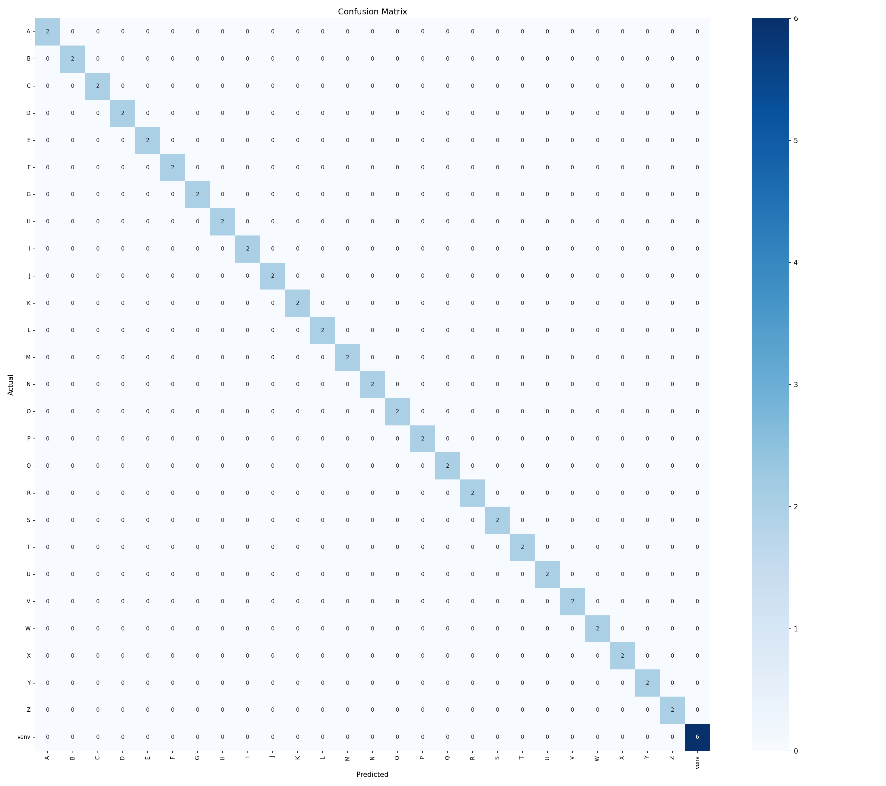
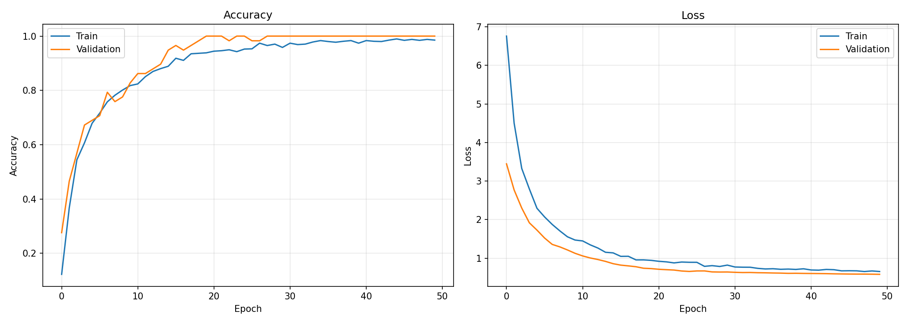

# 🖐️ BISINDO Hand Sign Recognition

> **Pengenalan Huruf Bahasa Isyarat Indonesia (BISINDO) Menggunakan Convolutional Neural Network (CNN) dengan Transfer Learning MobileNetV2**


---

# 📖 Deskripsi Proyek

Proyek ini bertujuan untuk membangun sistem **pengenalan huruf Bahasa Isyarat Indonesia (BISINDO)** menggunakan metode **Convolutional Neural Network (CNN)** dengan pendekatan **Transfer Learning** menggunakan arsitektur **MobileNetV2**.

Model dikembangkan untuk mengklasifikasikan **27 kelas** (huruf A–Z dan satu kelas Virtual Environment) berdasarkan citra isyarat tangan. Sistem ini diharapkan dapat menjadi langkah awal dalam pengembangan teknologi bantu berbasis kecerdasan buatan bagi penyandang tunarungu.

---

# 🎯 Tujuan

* Mengembangkan sistem pengenalan huruf BISINDO berbasis Artificial Intelligence (AI).
* Menerapkan metode Transfer Learning menggunakan MobileNetV2.
* Mengevaluasi performa CNN dalam klasifikasi citra bahasa isyarat.
* Mendukung penelitian di bidang Computer Vision dan teknologi asistif.

---

# 📥 Unduh Dataset

Dataset yang digunakan pada penelitian ini tersedia secara publik di Kaggle dan dapat diunduh melalui tautan berikut:

🔗 Kaggle Dataset:
https://www.kaggle.com/datasets/achmadnoer/alfabet-bisindo

# 📂 Dataset

| Properti            | Keterangan                                |
| ------------------- | ----------------------------------------- |
| **Jumlah Gambar**   | 312 gambar                                |
| **Jumlah Kelas**    | 27 kelas                                  |
| **Pembagian Data**  | 80% Training, 20% Validation              |
| **Augmentasi Data** | Rotasi, Brightness, Horizontal Flip, Blur |


### Struktur Dataset

```text
Dataset_Bisindo/
│
├── A/
│   ├── body dot (1).jpg
│   ├── body dot (2).jpg
│   ├── wall white (1).jpg
│   └── ...
│
├── B/
│   └── ...
│
├── ...
│
└── Z/
```

---

# 🏗️ Arsitektur Model

Model dibangun menggunakan **Transfer Learning MobileNetV2** sebagai feature extractor.

```text
MobileNetV2 (Pretrained - Frozen)
                │
GlobalAveragePooling2D
                │
BatchNormalization
                │
Dense 512 (ReLU)
L2 Regularization
                │
BatchNormalization
Dropout 0.5
                │
Dense 256 (ReLU)
L2 Regularization
                │
BatchNormalization
Dropout 0.4
                │
Dense 128 (ReLU)
L2 Regularization
                │
BatchNormalization
Dropout 0.3
                │
Dense 27 (Softmax)
```

---

# ⚙️ Konfigurasi Pelatihan

| Parameter           | Nilai                    |
| ------------------- | ------------------------ |
| Backbone            | MobileNetV2              |
| Optimizer           | Adam                     |
| Learning Rate       | 0.0003                   |
| Epoch               | 50                       |
| Batch Size          | 16                       |
| Loss Function       | Categorical Crossentropy |
| Total Parameter     | 3.090.267                |
| Trainable Parameter | 827.931                  |

---

# 📊 Hasil Evaluasi

Evaluasi dilakukan menggunakan data **validation**.

| Metrik                  | Hasil    |
| ----------------------- | -------- |
| **Validation Accuracy** | **100%** |
| **Precision**           | **1.00** |
| **Recall**              | **1.00** |
| **F1-Score**            | **1.00** |

> **Catatan:** Akurasi 100% diperoleh pada data validasi yang digunakan dalam penelitian. Performa model pada kondisi nyata dapat dipengaruhi oleh pencahayaan, sudut tangan, latar belakang, dan kualitas kamera.

---

# 📈 Visualisasi Hasil

## Confusion Matrix

<p align="center">
  
</p>

## Grafik Akurasi dan Loss

<p align="center">
  
</p>

---

# 📌 Akurasi per Kelas

| Huruf | Akurasi | Status |
| ----- | ------- | ------ |
| A – Z | 100%    | ✅      |
| H     | 100%    | ✅      |
| I     | 100%    | ✅      |
| M     | 100%    | ✅      |
| B     | 100%    | ✅      |
| E     | 100%    | ✅      |

---

# 📁 Struktur Repository

```text
BISINDO-Hand-Sign-Recognition/
│
├── Dataset_Bisindo/
├── model/
│   └── model.keras
├── notebook/
│   └── training.ipynb
├── confusion.png
├── plot.png
├── requirements.txt
├── README.md
└── LICENSE
```
